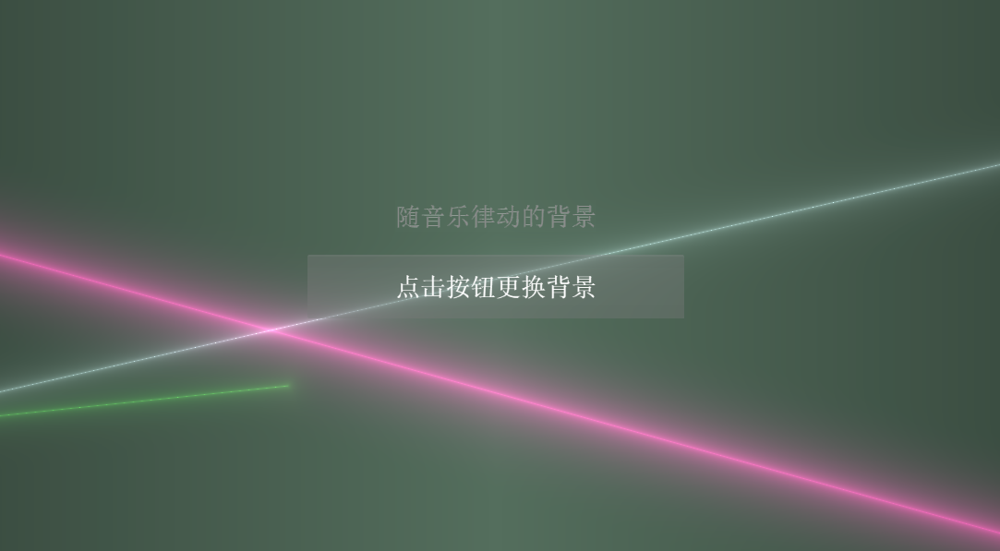
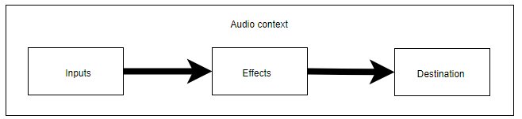
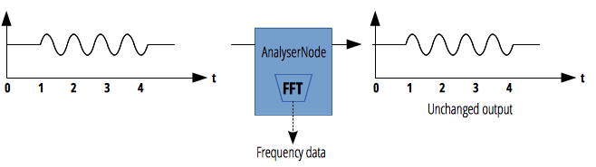

# AudioBackground for CocosCreator

#### 随音乐律动的背景 for CocosCreator

#### [在线示例](https://ltp.gitee.io/gym/cocos-creator/ShaderSample/wave-show/web-mobile/index.html)

---

## 制作随音乐律动的背景



Web Audio API 提供了在 Web 上控制音频的一个非常有效通用的系统，允许开发者来自选音频源，对音频添加特效，使音频可视化，添加空间效果 （如平移），等等。

Web Audio API 使用户可以在音频上下文(AudioContext)中进行音频操作，具有模块化路由的特点。在音频节点上操作进行基础的音频， 它们连接在一起构成音频路由图。即使在单个上下文中也支持多源，尽管这些音频源具有多种不同类型通道布局。这种模块化设计提供了灵活创建动态效果的复合音频的方法。



对于声音可视化表现，我们主要使用 AnalyserNode。AnalyserNode 接口表示了一个可以提供实时频域和时域分析信息的节点。它是一个不对音频流作任何改动的 AudioNode，同时允许你获取和处理它生成的数据，从而创建音频可视化。

律动的背景我们采用 shader 的方式生成，将通过 AnalyserNode 节点获取的声音频域采样数据作为纹理数据写入 cc.Texture2D 中，并作为参数 uChannel0 传递给 shader。

并不是所有的平台都支持 Web Audio API，比如微信小游戏，对于这中情况只能预先准备声音频域采样数据。

### 创建 AudioContext

对于不同的平台创建 AudioContext 的方法略有不同

```typescript
    if (window.AudioContext || window["webkitAudioContext"]) {
        let audioCtx: AudioContext = null
        if (window.AudioContext) {
            //安卓平台
            audioCtx = new window.AudioContext()
        } else {
            //IOS平台
            audioCtx = new window["webkitAudioContext"]()
        }
    else{
        //不能使用音频可视化，但仍然可以用cc.audioEngine.playXXXX播放音乐
        cc.log("不支持 window.AudioContext||window.webkitAudioContext... 太可怜啦!!!!!")
    }
```

### 创建并连接 AudioNode

创建各种 AudioNode，并把它们串行连接起来

其中 AudioBufferSource 的 AudioBuffer 数据我们使用cc.AudioClip的_audio字段

其中 AnalyserNode 是负责对采样帧的音频信号做快速傅里叶变换得到频域数据，是我们可视化数据的来源.



- AnalyserNode.fftSize: 代表了用于计算频域信号时使用的 FFT 的窗口大小，这个数值决定我们每帧可以从节点获取多少数据
- AnalyserNode.frequencyBinCount: 代表用于可视化的数据值的数量(为 fftsize 的一半)，我们用这个值初始化可视化数据缓冲
- AnalyserNode.getByteFrequencyData(): 将当前频域数据拷贝进 Uint8Array 数组，我们用这个方法获取可视化数据

```typescript
    //创建音源
    let bufferSource = audioCtx.createBufferSource();
    bufferSource.buffer = self.BackgroundSound["_audio"];//获取cc.AudioClip的_audio作为AudioBuffer 

    //创建放大器节点
    let gainnode = audioCtx.createGain();

    //创建AnalyserNode
    let backgroundSoundAnalyser = audioCtx.createAnalyser();
    backgroundSoundAnalyser.fftSize = 1024;

    //BufferSource(音源) --> AnalyserNode --> GainNode --> DestinationNode(喇叭)
    bufferSource.connect(backgroundSoundAnalyser);
    backgroundSoundAnalyser.connect(gainnode);
    gainnode.connect(audioCtx.destination);
```

### 播放声音并获取可视化数据

一般来说bufferSource.start()就可以播放声音，但是由于Web API的安全策略，网页在播放音频前需要收到用户操作(一般就是点击事件)，否则播放不会成功，仿造cc.audioEgine的写法

```typescript
    //注册一个事件，如果用户触摸屏幕则设置_touchPlay标记，并开始播放列表_bufferSourceList中的所有音频
    cc.game.canvas.addEventListener(touchEventName, function () {
        if (self._touchPlay) {
            return
        }
        self._touchPlay = true
        self._bufferSourceList.forEach((s: AudioBufferSourceNode) => {
            s.start()
        })
        self._bufferSourceList = []
    })
```

播放音频的代码如下

```typescript
    if (self._touchPlay) {
        //如果已有用户触摸动作，直接播放
        bufferSource.start()
    } else {
        //否则加入列表等待触摸事件
        self._bufferSourceList.push(bufferSource)
    }
```

声音一直在播放中，我们每隔一段时间获取一次可视化数据，并把这个数据填充为(宽度为frequencyBinCount/4，高度为1)的cc.Texture2D

```typescript
    //预先定义数据缓冲
    let backgroundSoundChannelBuffer: Uint8Array = null
    //存储可视化数据的纹理对象
    let backgroundSoundChannel = new cc.Texture2D()
    setInterval(() => {
        if (!self._touchPlay) {
            //没有播放就不用白忙活了
            return
        }
        //初始化数据
        if (backgroundSoundChannelBuffer == null) {
            backgroundSoundChannelBuffer = new Uint8Array(backgroundSoundAnalyser.frequencyBinCount)
            backgroundSoundChannel = new cc.Texture2D()
        }
        //获取可视化数据
        backgroundSoundAnalyser.getByteFrequencyData(backgroundSoundChannelBuffer)
        //用获取的数据填充纹理
        backgroundSoundChannel.initWithData(backgroundSoundChannelBuffer,
            cc.Texture2D.PixelFormat.RGBA8888,              //纹理格式RGBA各1个字节
            backgroundSoundChannelBuffer.length / 4 / 1,    //纹理宽度，由于4个字节为纹理的一个点，所以要除4
            1                                               //纹理高度为一个像素
        )

        //把纹理交给shader(这是一个自定义的纹理更新组件)
        shader.channel0 = backgroundSoundChannel
    }, 30)
```

### 展现数据

我们把音频数据变成纹理的形式作为变量"uChannel0"发送给shader，在shader中可以用 texture(iChannel0, vec2(0.1, 0.0));其中rgba的每一个分量都是某个频率的采样值

具体shader的表现方式就靠自己发挥了，在这个例子中，我是从[shadertoy.com](https://www.shadertoy.com)这个网站找的，在具体的effect文件中有标记出处

### 小结

- 使用[WebAudio API](https://developer.mozilla.org/zh-CN/docs/Web/API/Web_Audio_API)播放音乐
- 使用[AnalyserNode](https://developer.mozilla.org/zh-CN/docs/Web/API/AnalyserNode)获取声音频域采样数据
- 将声音频域采样数据作为 cc.Texture2D 的 buffer 数据，并传给 shader
- AudioManger: WebAudio 封装
- CustomRenderComponent: 自定义渲染组件，也可用 cc.Sprite 代替
- CustomShaderUpdate: 自定义Shader数据更新组件
- shader(ltp-NeonLines，ltp-SquaresBackground)改编自[shadertoy.com](www.shadertoy.com)，出处见 effect 文件内说明
